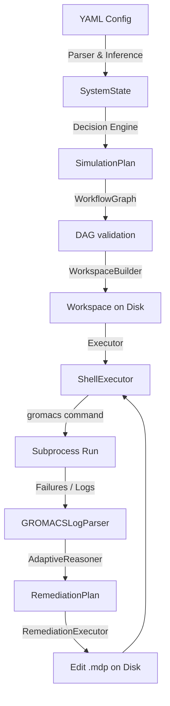
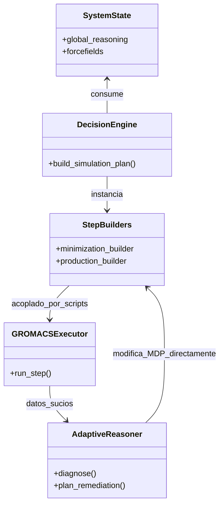
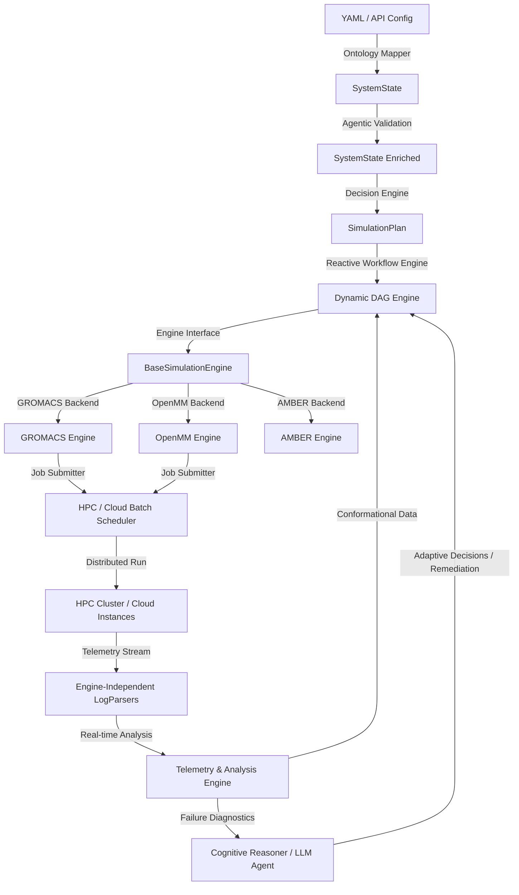

# Análisis de la Arquitectura de SimForge: Evaluación de Escalabilidad Científica

Este documento presenta una evaluación detallada de la arquitectura actual de SimForge a la luz de cinco objetivos clave de escalabilidad científica:
1. **Adaptive Molecular Dynamics (MD Adaptativa)**
2. **Soporte Multi-Motor (Multi-Engine)**
3. **Workflows Reproducibles**
4. **Razonamiento Automatizado (Automated Reasoning)**
5. **Campañas de Simulación a Gran Escala**

---

## 1. Estado de la Arquitectura Actual

SimForge está estructurado como un compilador de workflows moleculares que sigue el flujo:
$$\text{YAML} \longrightarrow \text{SystemState} \longrightarrow \text{SimulationPlan} \longrightarrow \text{WorkflowGraph (DAG)} \longrightarrow \text{WorkspaceBuilder (Disco)} \longrightarrow \text{RemediationExecutor (Runtime)}$$

El loop de ejecución actual implementa un ciclo reactivo de corrección de inestabilidades físicas y numéricas:

A nivel de código, la plataforma cuenta con una clara separación conceptual, pero tiene una fuerte orientación hacia ejecuciones locales de **GROMACS** controladas por scripts de bash y expresiones regulares de diagnóstico.

---

## 2. Evaluación Frente a Objetivos de Escalabilidad

### 2.1 Adaptive Molecular Dynamics (MD Adaptativa)
* **Requisito**: Ejecuciones condicionales basadas en el espacio de fases muestreado (ej. Markov State Models - MSM, muestreo adaptativo por distancia/RMSD, o algoritmos de enjambre). Requiere modificar la estructura del DAG sobre la marcha a partir del análisis de las trayectorias en ejecución.
* **Evaluación actual**: **No escalable**. El DAG generado por `WorkflowGraph` es **estático** y se define completamente en tiempo de compilación. No existe un canal de telemetría de coordenadas o trayectorias en tiempo real en los ejecutores; los análisis (`analysis_builder.py`) corren al final como un nodo final estático en lugar de actuar como un nodo de decisión intermedio que realimente el grafo.
* **Limitación**: El ciclo de remediación actual (`RemediationExecutor`) solo actúa en caso de **falla del proceso (crash)** para recuperar la estabilidad matemática (ej. reducir `dt`), no para redirigir la física del muestreo basándose en el progreso termodinámico o geométrico del sistema.

### 2.2 Soporte Multi-Motor (OpenMM, NAMD, AMBER, GROMACS)
* **Requisito**: Capacidad de alternar motores de dinámica molecular o cálculo de estructura electrónica (QM/MM) cambiando únicamente un parámetro en el archivo de configuración, traduciendo automáticamente inputs, topologías y formatos de control.
* **Evaluación actual**: **Críticamente acoplado a GROMACS**.
  - Los builders (`minimization_builder.py`, `equilibration_builder.py`, etc.) escriben directamente sintaxis `.mdp` y comandos `gmx grompp` / `gmx mdrun` en scripts shell locales.
  - La clase `GROMACSExecutor` y su parser de logs `GROMACSLogParser` dependen fuertemente del formato de salida de GROMACS.
  - `core/ontology.py` e `core/decision_engine.py` asumen conceptos específicos de GROMACS (como `.mdp`, `terminal_restraints` específicos de posición y el comando `gromacs:pdb2gmx`).
* **Limitación**: Añadir un motor como OpenMM o AMBER requeriría reescribir sustancialmente los step builders, duplicar la lógica de remediación y modificar el decision engine.

### 2.3 Workflows Reproducibles
* **Requisito**: Garantía de reproducibilidad exacta (mismos resultados físicos bajo las mismas condiciones). Exige control estricto de semillas pseudoaleatorias, aislamiento del entorno de software (contenedores), registro detallado de hardware, dependencias y procedencia de datos (provenance metadata).
* **Evaluación actual**: **Parcialmente preparado**. SimForge genera una estructura de carpetas muy limpia (`simforge_runs/`) con metadatos JSON y gráficos Mermaid que describen el flujo lógico.
* **Limitación**: 
  - Depende del entorno del host. Si la versión de GROMACS en la `PATH` cambia, la simulación puede cambiar o fallar.
  - No se encapsulan contenedores (Docker/Singularity/Apptainer) en la definición de ejecución.
  - No se capturan metadatos estandarizados de procedencia (como el estándar W3C PROV-O o Common Workflow Language - CWL).
  - No hay un forzado de semillas físicas consistentes (ej. `ld-seed` en GROMACS) dentro de las plantillas de los builders.

### 2.4 Razonamiento Automatizado (Automated Reasoning)
* **Requisito**: Capacidad del sistema para tomar decisiones complejas (ej. "el ligando se desestabiliza debido a tensiones en el anillo aromático; deberíamos cambiar el campo de fuerzas a GAFF2 con cargas AM1-BCC en lugar de CGenFF", o "hay un clash estérico evidente, corramos una minimización suave con restraints de distancia armónicos").
* **Evaluación actual**: **Heurística rígida basada en reglas fijas**.
  - La detección de errores utiliza expresiones regulares simples (`r"LINCS warning"`, `r"step\s+\d+,\s+LINCS"`) en `adaptive_reasoner.py`.
  - La toma de decisiones en `decision_engine.py` y el motor de remediación son tablas de dispatch rígidas con valores de ajuste predefinidos por el programador (ej. si `LINCS` $\rightarrow$ multiplicar `dt` por $0.5$).
* **Limitación**: El sistema carece de un modelo semántico profundo o de un agente inteligente capaz de interpretar la física subyacente de la simulación o sugerir hipótesis novedosas fuera de las rutas de error codificadas.

### 2.5 Campañas de Simulación a Gran Escala
* **Requisito**: Ejecución paralela masiva (cientos o miles de complejos ligando-proteína) en infraestructuras distribuidas como clusters de HPC (con schedulers como SLURM, LSF, PBS) o nubes públicas (AWS Batch, GCP Batch).
* **Evaluación actual**: **Incapaz de escalar en su estado actual**.
  - `BaseExecutor` procesa los pasos de manera **síncrona y secuencial** mediante un bucle `for record in self.state.steps:`.
  - Los scripts se ejecutan localmente en el host usando subprocesses de Python.
  - El estado de la ejecución se serializa en un único archivo JSON local (`execution_state.json`), lo cual generaría problemas severos de concurrencia e I/O si se intenta ejecutar en paralelo en un file system compartido.
  - No hay capacidad de encolamiento, reintentos distribuidos ni gestión de recursos de cómputo (CPUs/GPUs).

---

## 3. Riesgos Arquitectónicos y Puntos Críticos

A continuación, se tabulan los riesgos y puntos de acoplamiento identificados en el diseño actual:

### 3.1 Riesgos Arquitectónicos
| ID | Riesgo | Gravedad | Impacto Científico / Operativo |
| :--- | :--- | :--- | :--- |
| **R-01** | **Orquestación en Local Subprocess** | Alta | Bloquea el uso de HPC. SimForge no puede enviar trabajos a SLURM/PBS, limitando los experimentos a una sola máquina. |
| **R-02** | **DAG de Compilación Estático** | Alta | Impide la adaptación científica en caliente (ej. detener réplicas ineficientes o ramificar simulaciones según muestreo). |
| **R-03** | **Persistencia Basada en Archivo JSON Único** | Media | Cuello de botella en I/O. Si múltiples simulaciones paralelas escriben en `execution_state.json`, habrá corrupción por colisión de escritura. |
| **R-04** | **Remediación por Expresiones Regulares** | Media | Fragilidad operativa. Si la versión de GROMACS cambia levemente sus mensajes de error en stdout, el diagnóstico fallará silenciosamente. |

### 3.2 Módulos Demasiado Acoplados

1. **`core/decision_engine.py` $\longleftrightarrow$ `builders/step_builders/`**: El motor de decisiones asume implícitamente que cada etapa genera un conjunto específico de archivos GROMACS. La lógica sobre qué simular y cómo construir físicamente los inputs está mezclada.
2. **`executors/gromacs_executor.py` $\longleftrightarrow$ `executors/adaptive_reasoner.py`**: El analizador y el reasoner comparten dependencias muy cerradas de clases y estructuras GROMACS. El reasoner sabe exactamente qué parámetros MDP modificar en disco, rompiendo la abstracción del executor.
3. **`pipelines/` $\longleftrightarrow$ GROMACS**: Los pipelines científicos (ej. `inhibition_pipeline.py`) no son agnósticos; asumen una topología GROMACS predeterminada.

### 3.3 Cuellos de Botella de Rendimiento
1. **Bloqueo Síncrono de Hilos**: La ejecución en `BaseExecutor` detiene el proceso principal de Python esperando a que termine la simulación local, desperdiciando recursos CPU del host que podrían usarse para compilar o analizar otros pasos.
2. **Estrategia I/O Intensiva**: La lectura y escritura constante de archivos intermedios en disco local para comprobar estados de completado (`_check_expected_outputs`) penaliza el rendimiento en sistemas de archivos de red (NFS/Lustre) típicos de clusters científicos.

---

## 4. Propuesta de Arquitectura Futura (Desacoplada y Escalable)

Para mitigar los riesgos anteriores y asegurar el escalado, se propone la siguiente arquitectura modular:

### Componentes Clave Propuestos:
1. **BaseSimulationEngine**: Una interfaz abstracta que expone métodos como `prepare_system()`, `minimize()`, `equilibrate()`, `run_production()`. Cada backend (GROMACS, OpenMM) implementa sus particularidades.
2. **ResourceAdapter / Scheduler Drivers**: Abstracciones para interactuar con motores de colas (`SlurmDriver`, `KubernetesDriver`, `LocalAsyncDriver`). Los pasos del DAG se envían como trabajos asíncronos y no bloquean el proceso principal.
3. **Dynamic DAG Engine (Reactive Workflow)**: Un motor de ejecución que permite añadir, remover o modificar dependencias de nodos en tiempo de ejecución a partir de eventos emitidos por el `TelemetryEngine`.
4. **Cognitive Reasoner**: Sustituye la tabla de heurísticas fijas por un flujo híbrido (reglas deterministas para inestabilidades numéricas obvias + llamadas a Modelos de Lenguaje/Agentes de Razonamiento para la toma de decisiones científicas complejas).

---

## 5. Roadmap Técnico-Científico de Escalabilidad

Se propone un roadmap estructurado en **4 fases estratégicas** para transformar SimForge en una plataforma científica de grado de producción:

### Fase 1: Abstracción de Motores y Ejecución Asíncrona (Corto Plazo)
* **Objetivos**: Resolver el acoplamiento a GROMACS y la limitación de ejecución local.
* **Hitos**:
  1. **Definir la interfaz `BaseSimulationEngine`**: Aislar la lógica de escritura de parámetros físicos (ej. crear una representación interna neutra de parámetros MD como temperatura, presión, ensamble, acoplamiento, timestep, y traducirlos a `.mdp` para GROMACS o scripts Python para OpenMM).
  2. **Implementar `LocalAsyncExecutor` e integrar Schedulers (SLURM)**: Migrar el loop de ejecución a `asyncio`. Crear el primer driver de HPC (`SlurmAdapter`) para poder someter trabajos en clusters remotos sin bloquear el hilo principal.
  3. **Migrar la base de datos de estado**: Sustituir `execution_state.json` por una base de datos ligera embebida (ej. SQLite) para soportar múltiples procesos leyendo/escribiendo simultáneamente sin colisiones.

### Fase 2: Telemetría Científica y MD Adaptativa (Medio Plazo)
* **Objetivos**: Permitir muestreos moleculares inteligentes y reactivos.
* **Hitos**:
  1. **Telemetry Pipeline**: Crear analizadores rápidos en streaming (usando `MDAnalysis` o `MDTraj`) que procesen las coordenadas del sistema (ej. RMSD, distancias clave) durante la ejecución de la dinámica molecular de producción.
  2. **Dynamic DAG Builder**: Permitir la inyección de nodos de control condicional en `WorkflowGraph` (ej. "si la distancia ligando-sitio activo supera los 1.5 nm, abortar producción y ramificar a una nueva equilibración con restraints").
  3. **Protocolo de Reinicio Continuo**: Implementar en los motores el guardado y carga transparente de estados térmicos y geométricos (archivos `.cpt` o `state.xml`) para ramificaciones sin pérdida de momentum.

### Fase 3: Razonamiento Cognitivo y Ontologías (Medio-Largo Plazo)
* **Objetivos**: Dotar a la plataforma de criterio científico automatizado para remediaciones y diseño de pipelines.
* **Hitos**:
  1. **Agente de Remediación Científica (LLM/Agentic)**: Conectar un servicio de inferencia local o API (ej. Gemini/Claude) especializado en química computacional. Ante una falla atípica (ej. desnaturalización parcial, mala parametrización de carga), el agente lee el reporte físico y rediseña la estrategia del pipeline.
  2. **Grafo de Conocimiento Fisicoquímico**: Expandir `core/ontology.py` hacia un Grafo de Conocimiento real que mapee compatibilidades entre campos de fuerza (ej. CHARMM36), tipos de ligandos (ej. altamente cargados, flexibles) e iones necesarios, generando validaciones previas automáticas basadas en bases de datos moleculares.

### Fase 4: Campañas Masivas y Procedencia Formal (Largo Plazo)
* **Objetivos**: Escalabilidad a nivel industrial de diseño de fármacos y reproducibilidad absoluta.
* **Hitos**:
  1. **Workflow Engine Native Integration**: Opcionalmente, permitir que SimForge compile su DAG directamente a especificaciones nativas de orquestadores especializados de workflows científicos (ej. Nextflow o Snakemake) para delegar en ellos la gestión masiva de datos y cómputo distribuido.
  2. **Aislamiento en Contenedores Dinámico**: Generación automática de imágenes Apptainer/Singularity que encapsulen exactamente las versiones de software necesarias para cada step del sistema.
  3. **Estándar PROV-O**: Escribir un ledger de procedencia completo en formato JSON-LD al finalizar cada corrida, permitiendo la reproducibilidad exacta en cualquier infraestructura científica del mundo.

---

## 6. Conclusiones y Recomendaciones de Diseño

1. **Prioridad Inmediata**: La principal limitación para la adopción científica de SimForge es su dependencia de la ejecución local y síncrona en la máquina del usuario (R-01) y su acoplamiento de código con GROMACS (R-02).
2. **Recomendación de Refactorización**: Antes de implementar nuevos pipelines físicos, se recomienda rediseñar la clase `BaseExecutor` para que retorne promesas/futuros asíncronos y desacoplar los Step Builders de la generación directa de comandos shell de GROMACS.
3. **Viabilidad del Roadmap**: Las fases planteadas permiten un crecimiento orgánico: desde la infraestructura básica (motores y HPC) hasta la inteligencia científica aplicada (MD Adaptativa y Razonamiento Cognitivo), minimizando las reescrituras de código a medida que el proyecto escala.
